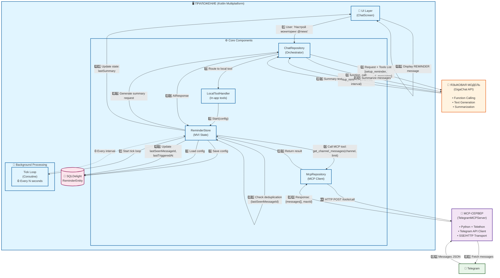

# Архитектура системы периодических напоминаний

## Общая схема взаимодействия компонентов



## Описание компонентов

### 🖥️ Приложение (Kotlin Multiplatform)

#### UI Layer
- **ChatScreen**: Интерфейс пользователя для ввода команд и отображения результатов
- Отображает сообщения типа `REMINDER` с саммари из Telegram каналов

#### Core Components
1. **ReminderStore (MVI)**
   - Управление состоянием напоминаний
   - Обработка интентов: `Start`, `Stop`, `UpdateConfig`
   - Запуск/остановка фонового tick loop

2. **ChatRepository**
   - Оркестратор взаимодействия с LLM
   - Объединение Local Tools + MCP Tools
   - Маршрутизация вызовов функций
   - Рекурсивные вызовы API при function calling

3. **LocalToolHandler**
   - Выполнение инструментов внутри приложения
   - Инструменты: `setup_reminder`, `update_reminder`, `stop_reminder`
   - Не требует внешних серверов

4. **McpRepository**
   - Клиент для вызова внешних MCP-серверов
   - HTTP/SSE транспорт
   - Парсинг результатов от MCP-серверов

#### Background Processing
- **Tick Loop**: Корутина с бесконечным циклом
  - Интервал настраивается через AI (10с - 1ч)
  - Выполняется независимо от UI
  - Автоматически возобновляется при перезапуске

#### Database
- **SQLDelight (ReminderEntity)**
  - Персистентное хранение конфигурации
  - Поля: `channel`, `intervalSeconds`, `messageCount`, `enabled`, `lastSeenMessageId`
  - Обеспечивает работу напоминаний после перезапуска приложения

### 🤖 Языковая модель (GigaChat API)

**Две роли в системе:**

1. **Настройка напоминаний (Function Calling)**
   - Получает список доступных инструментов
   - Анализирует запрос пользователя
   - Принимает решение вызвать `setup_reminder`
   - Возвращает `function_call` с параметрами

2. **Генерация саммари (Text Generation)**
   - Получает массив сообщений из Telegram
   - Создает краткое резюме содержимого
   - Возвращает отформатированный текст

**Ключевые возможности:**
- Function calling API для вызова инструментов
- Понимание естественного языка
- Генерация структурированных ответов

### 🐍 MCP-сервер (TelegramMCPServer)

**Технологии:**
- Python + Telethon (Telegram Client)
- Ktor (HTTP/SSE сервер)
- Model Context Protocol

**Предоставляемые инструменты:**
- `get_channel_messages`: Получение последних N сообщений из канала
- Параметры: `channel` (username), `limit` (количество сообщений)
- Возврат: JSON с массивом сообщений и `maxId` (для дедупликации)

**Транспорт:**
- HTTP/SSE для двустороннего общения
- Endpoint: `/tools/call` для вызова инструментов
- Поддержка длительных соединений

### 📱 Telegram
- Источник данных для мониторинга
- Публичные каналы без авторизации
- API для получения истории сообщений

## Потоки данных

### 1️⃣ Фаза настройки (Setup Flow)
```
Пользователь → UI → ChatRepository → LLM (function calling) →
LocalToolHandler → ReminderStore → SQLDelight → Tick Loop (Start)
```

**Время выполнения:** ~2-3 секунды (один API вызов)

### 2️⃣ Фаза периодического выполнения (Execution Flow)
```
Tick Loop → ReminderStore → McpRepository → MCP-сервер → Telegram →
MCP-сервер → McpRepository → ReminderStore → ChatRepository →
LLM (summarization) → ChatRepository → ReminderStore → UI
```

**Время выполнения:** ~1-2 секунды каждые N секунд (2 API вызова: MCP + LLM)

## Ключевые особенности архитектуры

### 🔄 Двухуровневая система инструментов
- **Local Tools**: Выполняются в приложении (setup, update, stop)
- **MCP Tools**: Выполняются внешним сервером (get_channel_messages)
- Бесшовная интеграция через единый интерфейс

### ⚡ Асинхронность
- Tick Loop работает в отдельной корутине
- Не блокирует UI
- Graceful shutdown при остановке

### 💾 Персистентность
- Конфигурация сохраняется в SQLDelight
- Автоматическое восстановление при перезапуске
- Отслеживание `lastSeenMessageId` для дедупликации

### 🎯 Дедупликация
- Каждое сообщение имеет уникальный ID
- `lastSeenMessageId` сохраняется после каждого выполнения
- Предотвращает повторную обработку одних и тех же сообщений

### 🔧 Расширяемость
- Легко добавить новые Local Tools
- Можно подключить дополнительные MCP-серверы
- Модульная архитектура с четким разделением ответственности

## Пример взаимодействия

```
👤 Пользователь: "Настрой мониторинг канала @news каждые 30 секунд, последние 10 сообщений"

🤖 LLM: function_call(setup_reminder, {channel: "news", interval: 30, count: 10})

⚙️ LocalToolHandler: Создает ReminderConfig → сохраняет в DB → запускает Tick Loop

⏰ Каждые 30 секунд:
   1. McpRepository → TelegramMCPServer: get_channel_messages("news", 10)
   2. TelegramMCPServer → Telegram API → возвращает [{id, text}, ...]
   3. Проверка: maxId == lastSeenMessageId? Если да → skip
   4. LLM: Summarize messages → "Главные новости: погода, политика, спорт..."
   5. DB: Обновить lastSeenMessageId
   6. UI: Показать REMINDER сообщение с саммари

🔔 Результат: Пользователь видит периодические обновления в чате
```

## Технологический стек

| Компонент | Технология |
|-----------|-----------|
| **Приложение** | Kotlin Multiplatform, Compose Multiplatform |
| **UI State** | MVI (Model-View-Intent) |
| **Database** | SQLDelight (SQLite) |
| **HTTP Client** | Ktor Client |
| **Coroutines** | kotlinx.coroutines |
| **DI** | Koin |
| **LLM API** | GigaChat (Sberbank) |
| **MCP Server** | Python 3.11, Ktor Server, Telethon |
| **Transport** | HTTP/SSE (Server-Sent Events) |
| **Protocol** | Model Context Protocol (MCP) |
